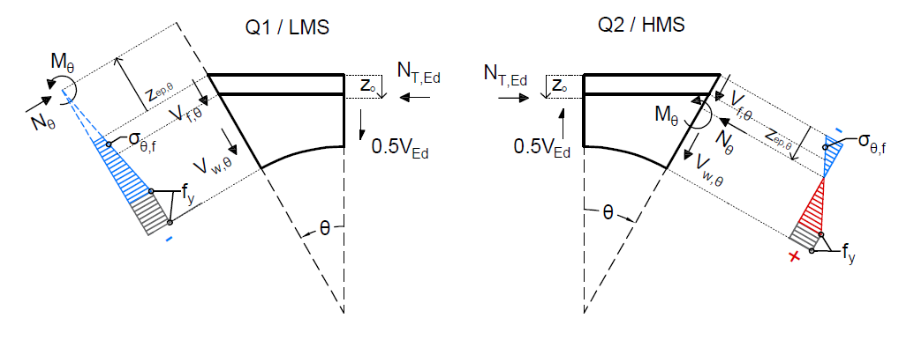

# Enhanced Radial Stress Method

Algorithmic implementation of the **Enhanced Radial Stress Method (Enhanced RSM)** for the *Vierendeel* bending design of perforated steel I-beams with circular or elliptical web openings, in accordance with **BS EN 1993-1-13:2024**.

The simplified methods in EN 1993-1-13 evaluate the *Vierendeel* bending resistance at a small number of predetermined cross-sections and select either the elastic or the fully plastic resistance according to the section classification, which produces a step between the two. The Enhanced RSM removes that step by allowing the inclined Tee section to develop a continuous level of plasticity – but in doing so it replaces a closed-form evaluation with an iterative search, which is why it needs software.



Three features make the method impractical by hand:

- the **level of plasticity is unknown** and must be found by increasing a strain factor `n` until the applied moment on the inclined plane equals the section's elasto-plastic resistance, each trial requiring the solution of a quadratic equilibrium relation;
- the **critical plane is unknown** — the most highly stressed inclined section migrates around the opening edge as the load and the shear–moment ratio change, so it must be searched for;
- the **capacity depends on moment redistribution** between the lower and higher moment sides, which is itself determined incrementally and bounded by two competing limits.

This package implements that method as a small, dependency-light Python library with a command-line interface.

---

## Installation

Requires Python 3.9 or later.

```bash
git clone https://github.com/REPLACE-USERNAME/enhanced-radial-stress-method.git
cd enhanced-radial-stress-method

python -m venv .venv
source .venv/bin/activate          # Windows: .venv\Scripts\activate

pip install -r requirements.txt    # pinned versions, for reproducibility
pip install -e .                   # installs the `enhanced-rsm` command
```

A `Dockerfile` is also provided if you want a fully reproducible environment:

```bash
docker build -t enhanced-rsm .
docker run --rm enhanced-rsm --help
```

---

## Quick start

Analyse a UB 457×152×52 in S355 with a circular opening of 75 % of the section depth, at a moment-to-shear ratio of 1.333 m:

```bash
enhanced-rsm el1 --h 449.8 --ho 337.35 --bf 152.4 --tw 7.6 --tf 10.9 --r 10.2 --fy 355 --mv 1.333
```

```
Enhanced RSM - mode 'el1'
=========================
  duration                : 0.037
  V_ed_EL1                : 78.00
  M_ed_EL1                : 103.97
  theta_critical_Q1       : 18
  theta_critical_Q2       : 27
  theta_critical_Q3       : 27
  theta_critical_Q4       : 18
  s_edge_max_Q1           : -356.19
  s_edge_max_Q2           : 265.63
  s_edge_max_Q3           : -265.63
  s_edge_max_Q4           : 356.19
  s_edge_360              : 360 values (use --stresses to print)
```

The same analysis from Python:

```python
from enhanced_rsm import run_mode_el1

result = run_mode_el1(h=449.8, h_o=337.35, b_f=152.4, t_w=7.6,
                      t_f=10.9, r=10.2, f_y=355, M_V_Ratio=1.333)

print(result.V_ed_EL1)          # 78.0 kN
print(result.theta_critical_Q1) # 18 degrees
print(result.s_edge_360.shape)  # (360,)
```

---

## Analysis modes

All four modes share the same numerical core and differ only in what they hold fixed and what they solve for. They are best understood as **one method with four entry points**.

| Mode | Command | What it determines |
|------|---------|--------------------|
| **EL1** | `el1` | Elastic limit — the shear at which the lower moment side (LMS) first yields |
| **EL2** | `el2` | Elastic limit of the higher moment side (HMS), plus the plasticity already developed on the LMS at that shear |
| **PLCAP** | `plcap` | Plastic capacity, with and without moment redistribution from the LMS to the HMS |
| **Given Forces** | `given-forces` | The state of the opening at a prescribed shear and moment |

Two of these correspond to response stages identified in the finite element studies (the elastic limit and the plastic capacity). The other two are operational entry points: EL2 reports the companion higher-moment-side limit, and Given Forces lets an engineer inspect the section at a chosen pair of forces.

### Shared arguments

Every mode takes the section geometry and material:

| Flag | Quantity | Unit |
|------|----------|------|
| `--h` | section depth | mm |
| `--ho` | opening diameter | mm |
| `--bf` | flange width | mm |
| `--tw` | web thickness | mm |
| `--tf` | flange thickness | mm |
| `--r` | root radius | mm |
| `--fy` | yield strength | MPa |

Plus two output options: `--output FILE` writes the full results to JSON, and `--stresses` prints the edge-stress distribution.

### Mode-specific arguments

`el1`, `el2`, `plcap` take `--mv`, the moment-to-shear ratio at the opening centre-line (m). `el2` and `plcap` also accept `--max-n` (default 20), the upper bound of the plasticity strain factor grid — raising it is not normally necessary, since values beyond full plasticity are not physically meaningful.

`given-forces` takes `--ved` (applied shear, kN) and `--med` (applied moment, kNm), and optionally `--ved-el1` (the elastic limit in kN, computed automatically if omitted).

### Examples

```bash
SECTION="--h 449.8 --ho 337.35 --bf 152.4 --tw 7.6 --tf 10.9 --r 10.2 --fy 355"

# Plastic capacity with redistribution
enhanced-rsm plcap $SECTION --mv 1.333

# Elastic limit of the higher moment side
enhanced-rsm el2 $SECTION --mv 2.333

# State of the opening at 100 kN / 133 kNm, saved to JSON
enhanced-rsm given-forces $SECTION --ved 100 --med 133 --output state.json
```

---

## Conventions

Getting these right matters when comparing results with finite element output.

**Units.** Interfaces use engineering units — lengths in mm, yield strength in MPa, shear in kN, moments in kNm. Internally the calculations are carried out in N and N·mm and converted at the boundary.

**Quadrants.** The opening edge is divided into four quadrants. Q1 and Q2 belong to the upper Tee, Q4 and Q3 to the bottom Tee. Q1 and Q4 are on the lower moment side (LMS), Q2 and Q3 on the higher moment side (HMS).

**Planes.** Each quadrant is discretised into 91 inclined planes at one-degree increments from 0° to 90° measured from the vertical.

**Edge stress.** Tension positive, to match the finite element results. The `s_edge_360` array runs continuously around the whole opening perimeter.

---

## How it works

The performance of the solver rests on expressing the inner calculations as operations on arrays rather than as explicit loops, which is what makes an otherwise intractable iterative method run interactively.

Two vectorisation strategies are used according to the question being asked. For the **elastic limit**, the calculation is vectorised over the *load* axis: a grid is formed whose axes are the plane position and the trial shear force, and the edge stress is evaluated for the entire grid in one array operation, the first plane to yield then being recovered by array reductions. For the **elasto-plastic** analysis, the calculation is vectorised over the *plasticity* axis: at each shear force the section is solved for every plane and every trial value of `n` simultaneously.

The package is organised accordingly:

```
enhanced_rsm/
├── core.py                     shared geometry, section properties and kernels
├── tee_bending_resistance.py   Tee resistances at the opening centre-line
├── el1.py                      elastic limit (LMS)
├── el2.py                      elastic limit (HMS)
├── plcap.py                    plastic capacity with redistribution
├── given_forces.py             state at prescribed forces
└── cli.py                      command-line interface
```

`core.py` holds everything the four modes have in common — the section properties at every plane, the force-equilibrium relations, the elasto-plastic neutral-axis solve, the plasticity search and the redistribution step. Each mode module contains only its own orchestration.

---

## Validation

The method itself is validated against non-linear finite element analyses and test results in the publications listed below; this repository is the implementation of that validated method.

> **Note.** Results produced by this public implementation should agree with those reported in the accompanying thesis and papers. Where a discrepancy arises, the publications take precedence and the difference should be reported as an issue.

---

## Citing this work

If you use this software in published work, please cite both the software and the method.

**Software** — see `CITATION.cff`, or use the archived release DOI.

**Method** — References for the accompanying papers:

- Psyrras, G., Tsavdaridis, K.D. and Lawson, R.M. (2026) ‘Enhanced Radial Stress Method (RSM) for cellular beams in EN 1993-1-13 to account for elasto-plastic behaviour’, Journal of Constructional Steel Research, 239, p. 110221. Available at: https://doi.org/10.1016/J.JCSR.2025.110221.

---

## Roadmap

- **Elliptical openings.** The same four algorithms apply; the difference is in the geometry, where the inclined plane must be constructed from the local geometry of the ellipse and the perimeter is discretised at equal arc-length intervals by numerical integration. Support is planned.
- **Test suite** asserting the published results.

---

## Licence

**All rights reserved** for the time being — see [`LICENSE`](LICENSE).

This repository is public so that supervisors, examiners and reviewers can
inspect the code behind the results reported in the accompanying thesis and
papers. You are welcome to read and download it for that purpose, but it is not
yet licensed for use, modification or redistribution.

Following the successful defence of the thesis the code will be re-released
under a permissive open-source licence. If you would like to use it before then,
please get in touch.

---

## Acknowledgements

City St George's, University of London
